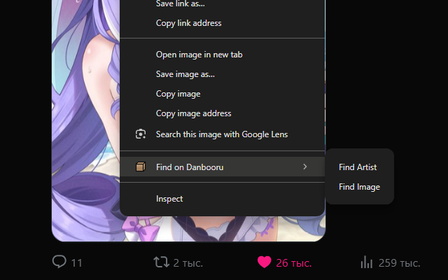

# Find on [Danbooru](https://danbooru.donmai.us/)

**The extension adds a search for a [picture](https://danbooru.donmai.us/iqdb_queries) or
[artist](https://danbooru.donmai.us/artists) on [Danbooru](https://danbooru.donmai.us/) to the context menu**

